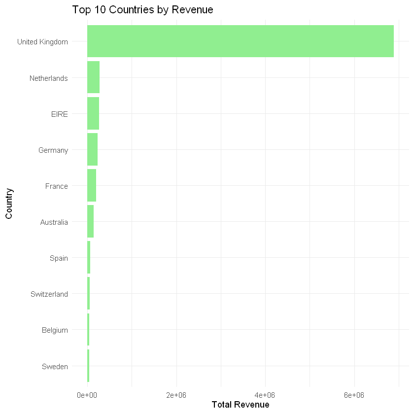
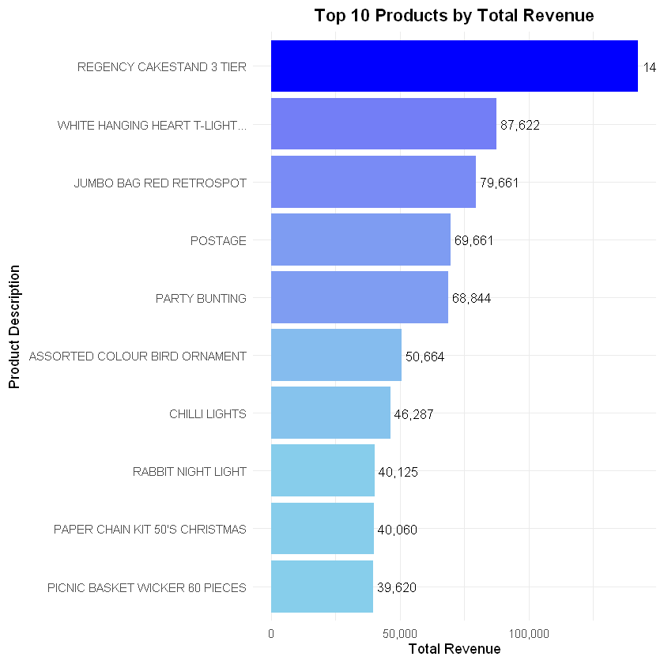
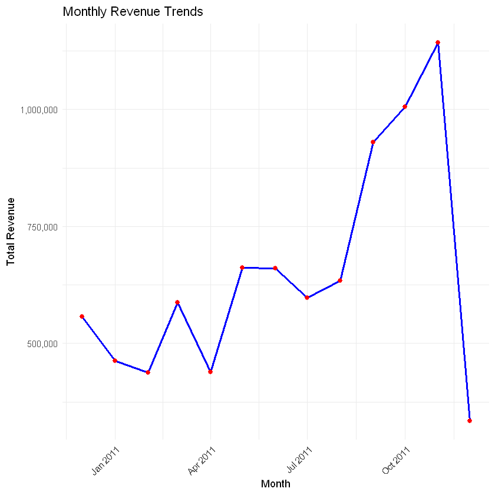
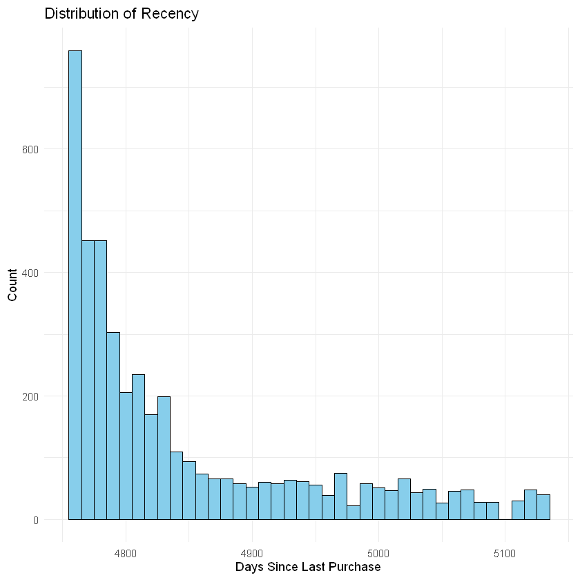
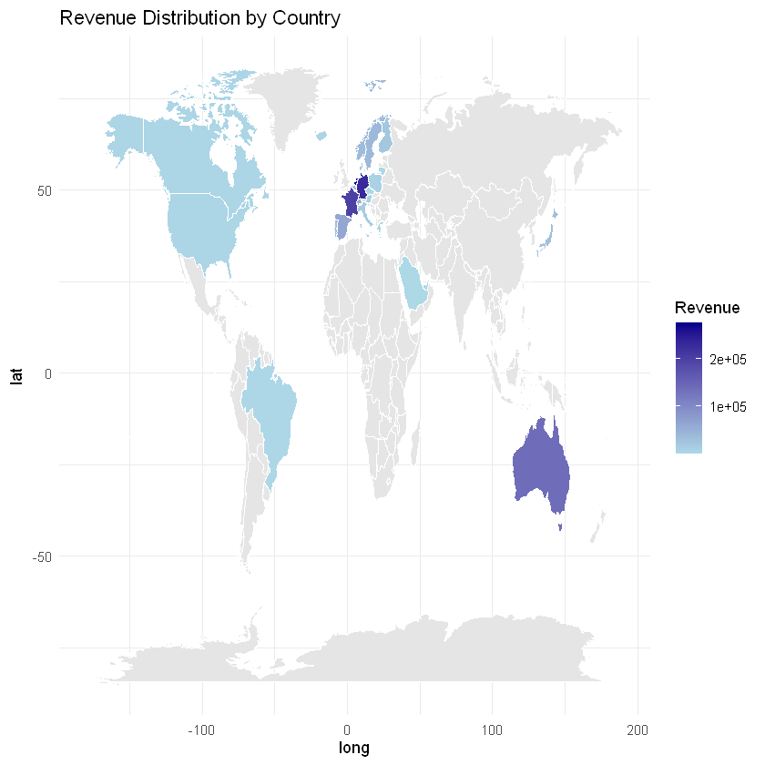
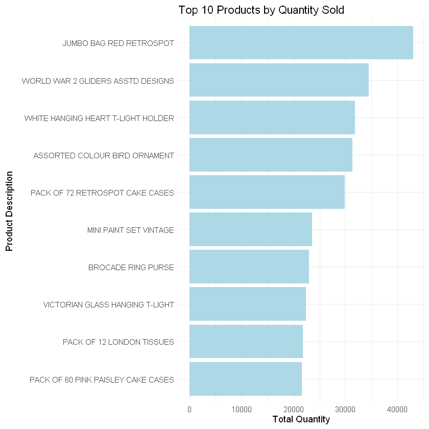
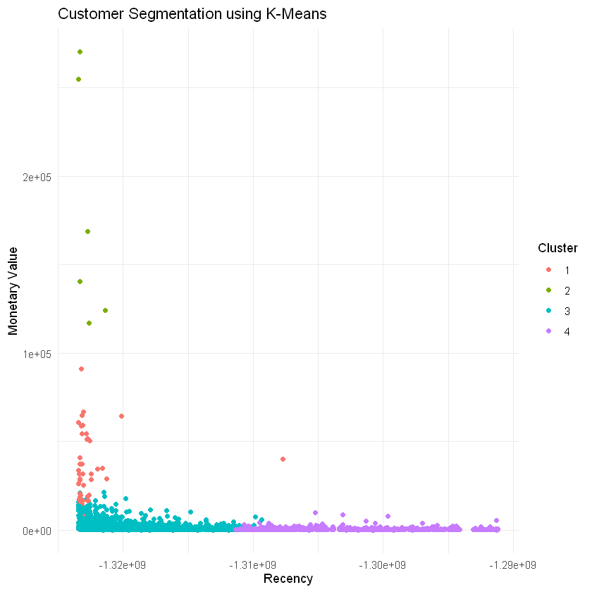
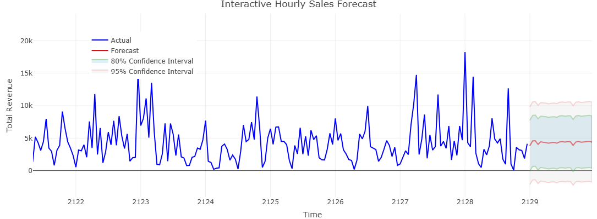
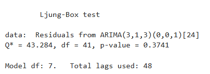
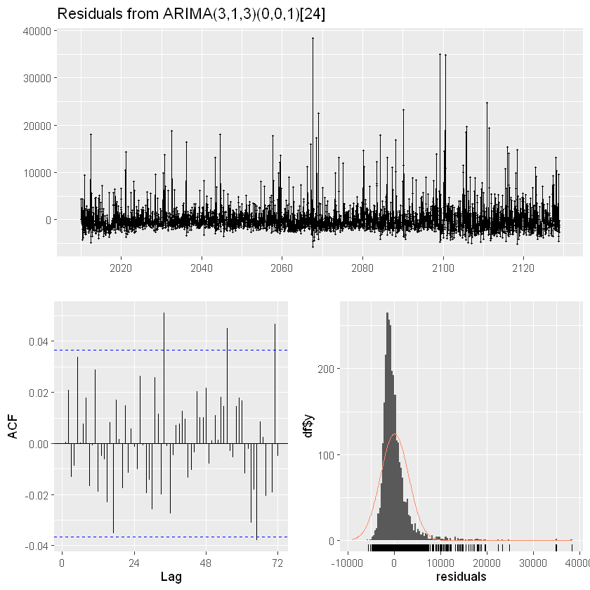

# 🌟 Online Retail Analysis 📊


> Unlock valuable insights and improve decision-making with advanced data analysis and predictive modeling using the **Online Retail Dataset**.  

---

## 🚀 Project Overview  
This project demonstrates an end-to-end data science workflow using the **Online Retail Dataset**. From cleaning messy data to forecasting sales and segmenting customers, the project combines statistical analysis, machine learning, and visualization to deliver actionable insights.

---

## 🎯 Objectives
- 🔍 **Data Cleaning**: Prepare raw data for reliable analysis.  
- 📈 **EDA**: Identify trends in sales and customer behavior.  
- 📊 **Forecasting**: Predict future sales with time-series models.  
- 🛒 **Customer Segmentation**: Classify customers based on purchase behavior.  
- 📊 **Interactive Dashboard**: Visualize trends and predictions with Shiny.  

---

## 📂 Dataset Information
**Source**: [UCI Machine Learning Repository](https://archive.ics.uci.edu/ml/datasets/Online+Retail)  
**Content**:
- 🧾 `InvoiceNo`: Unique transaction code.  
- 📦 `StockCode`: Product identifier.  
- 📝 `Description`: Product description.  
- 🔢 `Quantity`: Number of products purchased.  
- 📅 `InvoiceDate`: Date and time of transaction.  
- 💰 `UnitPrice`: Price per unit of product.  
- 🆔 `CustomerID`: Unique customer ID.  
- 🌍 `Country`: Customer location.

---

## 🛠️ Tools and Technologies
| **Category**         | **Tools Used**                                     |
|-----------------------|---------------------------------------------------|
| **Languages**         |  |
| **Visualization**     | `ggplot2`, `plotly`, `shiny`                      |
| **Data Wrangling**    | `dplyr`, `janitor`, `tidyverse`, `lubridate`      |
| **Forecasting**       | `forecast`, `prophet`                             |
| **Customer Analysis** | `caret`, `cluster`, `factoextra`                  |

---

## 🔧 Project Workflow  
1. **Data Cleaning**  
   - Handle missing values and invalid data.  
   - Generate new features like total revenue.  

2. **Exploratory Data Analysis (EDA)**  
   - Visualize trends, top products, and country-wise sales.  

3. **Sales Forecasting**  
   - Use ARIMA and Prophet for predicting future revenue.  

4. **Customer Segmentation**  
   - Perform RFM analysis to classify customers into loyalty tiers.  

5. **Interactive Dashboard (Optional)**  
   - Build a Shiny app to showcase key insights dynamically.

---

## **3. Exploratory Data Analysis (EDA)** 📊

Exploratory Data Analysis (EDA) was conducted to uncover insights into sales performance, top products, and revenue trends over time.

---

### **3.1 Top 10 Countries by Revenue**
The chart below highlights the top-performing countries by total revenue, with the **United Kingdom** contributing the most significantly.



---

### **3.2 Top 10 Products by Total Revenue**
The following plot shows the **top 10 products** that generated the highest revenue.  
The product **"REGENCY CAKESTAND 3 TIER"** dominates as the top-selling item.



---

### **3.3 Monthly Revenue Trends**
This time-series plot displays the **monthly revenue trends** throughout the year.  
There is a noticeable **increase in revenue** during the last quarter, followed by a steep drop, likely indicating incomplete December data.



---

### **3.4 Distribution of Recency (Customer Segmentation)**
The distribution of **recency** – days since a customer's last purchase – shows important insights into customer activity.



**Key Insights**:
1. **Majority of Customers are Inactive**:
   - A significant portion of customers have not made a purchase in a long time, indicating potential churn.

2. **Skewed Distribution**:
   - Most customers have high recency values (inactive), while very few have low recency values (recent activity).

3. **Retention Opportunity**:
   - Customers with high recency values can be targeted with **re-engagement campaigns** to revive interest.
   - Recent customers should be incentivized to ensure continued loyalty.

---

### **3.5 Revenue Distribution by Country**
The map below visualizes **revenue distribution across countries**.  
Countries with higher revenue are highlighted in darker shades. The **United Kingdom** and **Australia** dominate in terms of revenue contribution.



**Key Insights**:
- Revenue is concentrated in a few major markets, primarily in the **UK**, followed by other European countries and Australia.
- Emerging opportunities may exist in countries with lower revenue contributions.

---

### **3.6 Sales Trends by Hour of Day**
The plot below shows the **total revenue generated across different hours of the day**.  


**Key Insights**:
1. Sales activity **peaks between 10 AM and 3 PM**, with the highest revenue observed around midday.
2. Early mornings and evenings have lower sales volumes, suggesting focused business hours.

---

### **3.7 Top 10 Products by Quantity Sold**
The following chart highlights the **top 10 products** in terms of quantity sold.  
**"JUMBO BAG RED RETROSPOT"** is the most sold product, followed by **"WORLD WAR 2 GLIDERS ASSTD DESIGNS"**.



**Key Insights**:
- Top-selling products by quantity differ from top revenue-generating products.
- Lower-priced products may dominate in quantity, while premium products contribute more to total revenue.

---

### **Summary of EDA**:
1. **Revenue Distribution**:
   - The **United Kingdom** is the leading country in revenue generation.
   - Seasonal peaks are observed during the last quarter.

2. **Product Analysis**:
   - **"REGENCY CAKESTAND 3 TIER"** generates the most revenue.
   - **"JUMBO BAG RED RETROSPOT"** is the most frequently purchased product.

3. **Customer Behavior**:
   - Sales activity peaks during **midday hours**.
   - Recency analysis suggests opportunities for **re-engagement campaigns** to target inactive customers.

4. **Geographical Insights**:
   - Revenue is concentrated in key markets like the **UK** and **Australia**, with untapped potential in other regions.

---

## 🔧 **Feature Engineering**

Feature Engineering transforms raw data into meaningful insights and improves the performance of machine learning models. The following steps were performed:

### **1. RFM Features**  
- **Recency**: Days since the customer's last purchase.  
- **Frequency**: Number of transactions per customer.  
- **Monetary Value**: Total revenue generated by each customer.  

### **2. Time-Based Features**  
- Extracted features like **hour**, **day**, **week**, and **month** from the purchase date to capture temporal purchasing patterns.

### **3. Revenue and Quantity Metrics**  
- **Average Revenue per Order**  
- **Total Revenue per Customer**  
- **Average Quantity Sold per Transaction**  

### **4. Customer Segmentation**  
- Applied **K-Means Clustering** to segment customers based on RFM scores, identifying high-value and low-value groups.  

### **Purpose**  
These engineered features enable better analysis, improved model performance, and actionable customer insights. 🚀  

### **5. Customer Segmentation using K-Means**

The K-Means clustering algorithm was applied to segment customers based on their RFM features:  

- **Recency**: Time since last purchase.  
- **Frequency**: Total number of purchases.  
- **Monetary Value**: Total revenue generated.  

The resulting clusters are visualized below:  

#### **K-Means Clustering Plot**  
<div align="center">  
    
</div>  

### **Insights**  
- **Cluster 1 (Red)**: High-value and frequent buyers.  
- **Cluster 2 (Green)**: Customers with high monetary value but low frequency.  
- **Cluster 3 (Cyan)**: Regular customers with moderate activity.  
- **Cluster 4 (Purple)**: Infrequent and low-value customers.  

**Purpose**:  
This segmentation helps businesses identify customer behaviors, enabling targeted marketing strategies and resource optimization. 🚀  

---

## 6. Predictive Modeling 📈

### **Sales Forecasting**

We applied **ARIMA** (AutoRegressive Integrated Moving Average) to predict hourly sales trends for better inventory and revenue planning. The baseline model was configured using **ARIMA(3,1,3)(0,0,1)[24]**, indicating seasonal adjustment with 24-hour cycles.

**Steps:**
- Prepared hourly revenue data and tested for stationarity.
- Optimized ARIMA model parameters using AIC for best fit.
- Forecasted future hourly sales with **confidence intervals** (80% and 95%) to account for uncertainty.
- Validated the model using residual analysis and Ljung-Box test.

**Results:**
- **Forecast Plot**: Displayed actual vs. predicted sales with confidence intervals.
- **Residual Analysis**: The residuals appear random with no significant autocorrelation, suggesting a good model fit.

#### Key Metrics:
- **Mean Error (ME)**: `11.77`
- **Root Mean Squared Error (RMSE)**: `3039.78`
- **Mean Absolute Error (MAE)**: `1843.33`
- **Mean Absolute Percentage Error (MAPE)**: `336.65%`
- **Ljung-Box Test (p-value)**: `0.3741` (Residuals show no significant autocorrelation).

**Plots:**
1. **Interactive Hourly Sales Forecast**: Shows the actual values vs. the forecasted values along with confidence intervals.  
   

2. **Residual Diagnostics**: Ensures residuals are normally distributed and uncorrelated, validating model accuracy. 
    
   

---

### **Next Steps**
- Further refine the model using additional seasonal components or deep learning techniques (LSTM).
- Explore ensemble methods (e.g., SARIMA + XGBoost) to improve forecast accuracy.
- Scale forecasting to include monthly or weekly sales trends.

## 💻 Installation and Usage
1. **Clone the repository**:
   ```bash
   git clone https://github.com/yasirusama61/online-retail-analysis.git

2. **Install required R packages**:
   ```bash
   install.packages(c("tidyverse", "janitor", "lubridate", "ggplot2", "readxl", "forecast", "prophet"))

3. **Run the scripts**:
   Navigate to the notebooks/ folder to execute individual analysis steps.
   For the Shiny dashboard, open and run shiny_dashboard/app.R.

---

## 🚀 Contributions

This project was a collaborative effort aimed at analyzing and forecasting sales data using machine learning techniques and statistical models. The following contributions were made:

1. **Data Cleaning and Preprocessing**:
   - Removed missing values and invalid records.
   - Normalized and aggregated data to prepare it for analysis.

2. **Exploratory Data Analysis (EDA)**:
   - Analyzed sales trends (hourly and monthly).
   - Identified top-selling products, revenue-generating countries, and customer behavior.
   - Visualized insights using interactive and static plots.

3. **Feature Engineering**:
   - Created RFM (Recency, Frequency, Monetary) features for customer segmentation.
   - Extracted time-based features to capture sales patterns (hour, month, etc.).
   - Generated derived metrics like average revenue per order and demand metrics.

4. **Customer Segmentation**:
   - Performed clustering (K-Means) on RFM features to segment customers into actionable groups.

5. **Forecasting**:
   - Implemented **ARIMA** and **LSTM** models for time-series sales forecasting.
   - Evaluated model performance using metrics such as RMSE, MAE, and residual diagnostics.

6. **Visualizations**:
   - Built informative plots to communicate key insights, including:
     - Revenue trends
     - Residual diagnostics
     - Customer segmentation
   - Used tools like **ggplot2** and **plotly** for interactive data visualizations.

---

## 📚 References

1. **Online Retail Dataset**:  
   - Source: [UCI Machine Learning Repository - Online Retail Dataset](https://archive.ics.uci.edu/ml/datasets/online+retail)  
   - Description: A transactional dataset of a UK-based online retailer containing purchase details between 2010 and 2011.

2. **R Packages**:  
   - **tidyverse**: For data manipulation and cleaning.  
     [Link: tidyverse.org](https://www.tidyverse.org/)  
   - **lubridate**: For date-time handling.  
     [Link: lubridate on CRAN](https://cran.r-project.org/web/packages/lubridate/index.html)  
   - **janitor**: For cleaning column names and data.  
     [Link: janitor on CRAN](https://cran.r-project.org/web/packages/janitor/index.html)  
   - **forecast**: For ARIMA time-series modeling.  
     [Link: forecast on CRAN](https://cran.r-project.org/web/packages/forecast/index.html)  
   - **keras** and **tensorflow**: For building and training LSTM deep learning models.  
     [Link: Keras for R](https://tensorflow.rstudio.com/keras/)

3. **Clustering Algorithms**:
   - **K-Means**: For customer segmentation based on RFM features.  
     [Link: K-Means Clustering](https://en.wikipedia.org/wiki/K-means_clustering)

4. **Time-Series Forecasting Concepts**:  
   - ARIMA: AutoRegressive Integrated Moving Average Model.  
   - LSTM: Long Short-Term Memory Model for sequential data.

---

